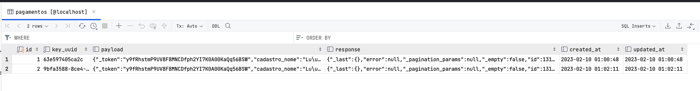
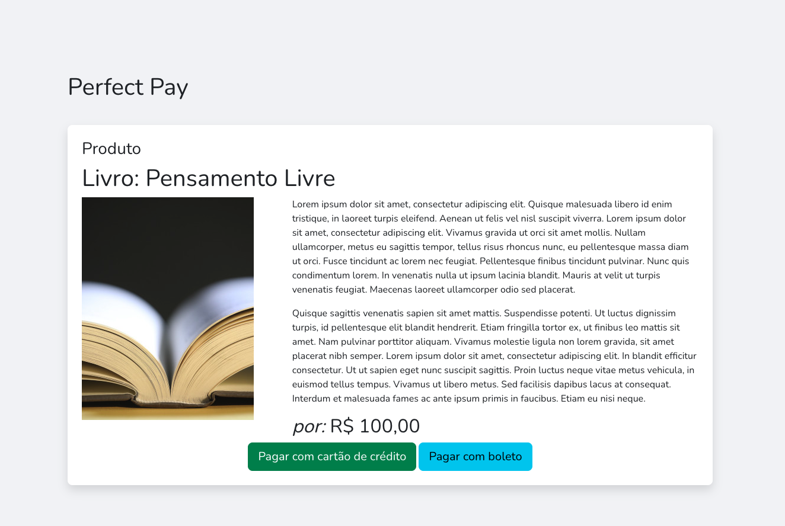
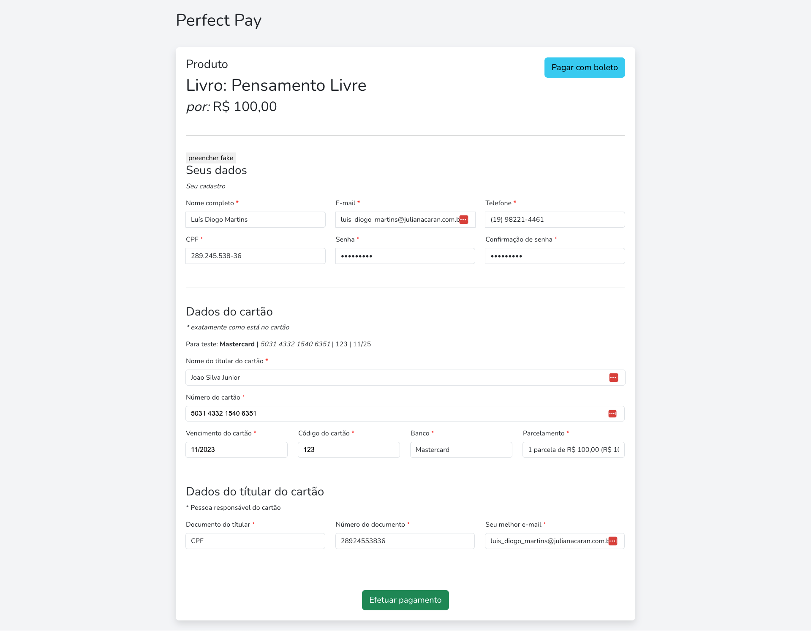
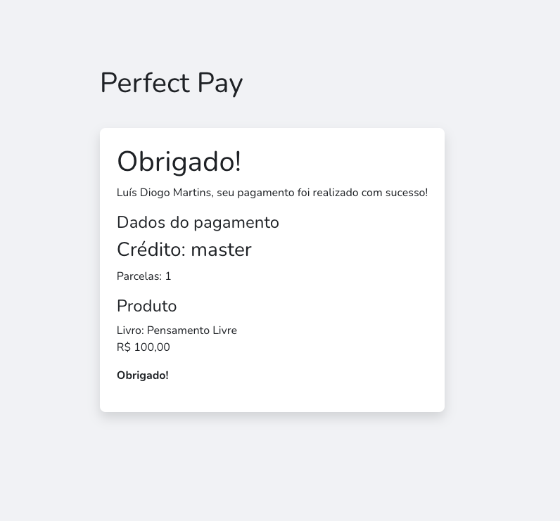
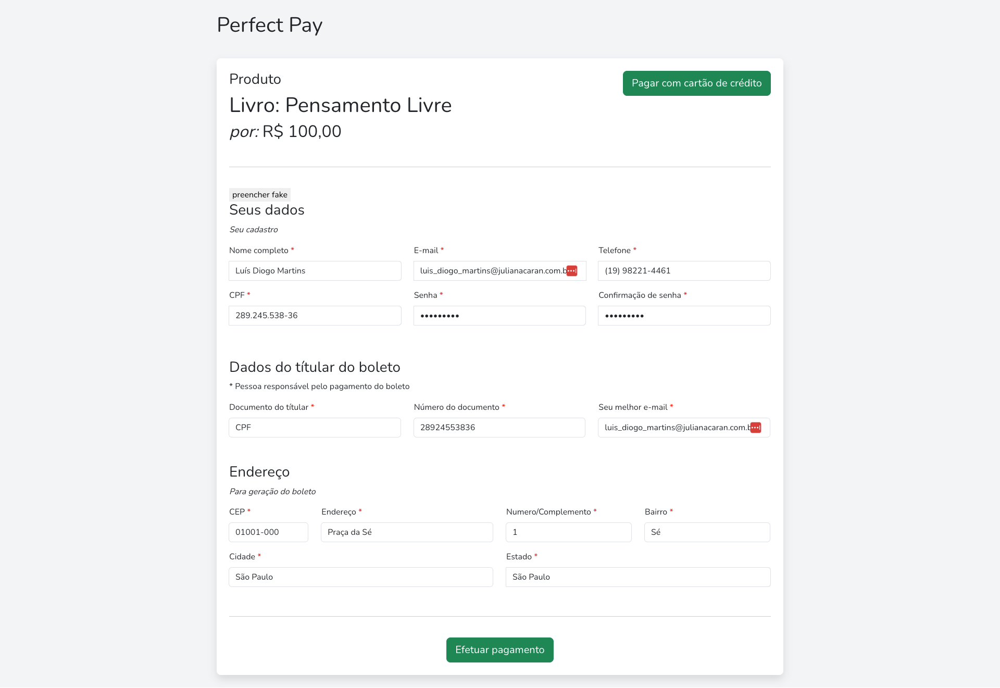
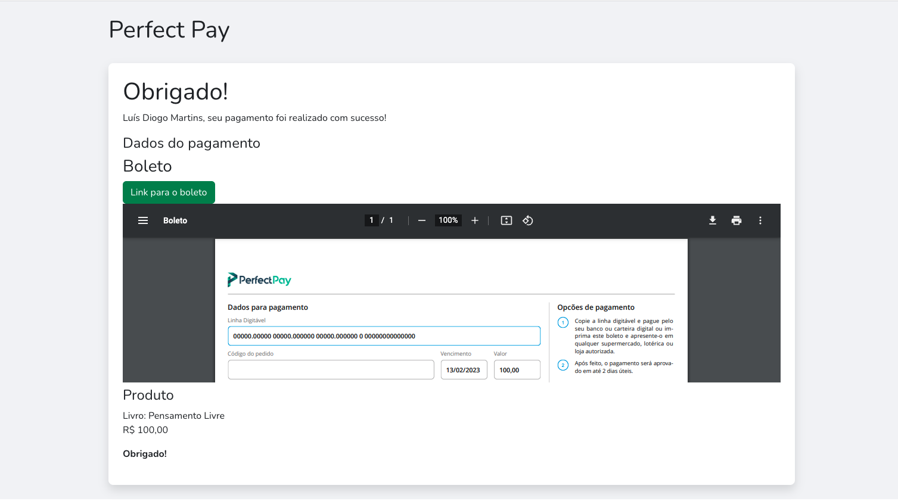

# Perfect Pay - Pagamentos

Projeto em Laravel 9.X 

- Integração com Mercado Pago https://github.com/mercadopago/sdk-php

## Requisitos

### Formulario com inputs necessarios pra processar o pagamento

- [x] botão 'finalizar pagamento', e se o pagamento der certo direcionar para uma página de obrigado
- [x] utilizar laravel para o desenvolvimento
- [ ] não precisa de banco de dados
- [x] processamento de pagamentos com boleto e cartão de crédito
- [x] se o pagamento for boleto mostrar um botão com o link do boleto na pagina de obrigado
- [x] não é necessario se importar com a qualidade do front, usar um bootstrap bem básico
- [x] utilizar a bilioteca php desenvolvida pelo mercado pago

## Mercado Pago

- https://www.mercadopago.com.br/developers/pt/docs/checkout-api/landing
- https://www.mercadopago.com.br/developers/pt/docs/sdks-library/landing

## Cartões de credito para teste

- https://www.mercadopago.com.br/developers/pt/docs/checkout-api/integration-test/test-cards

## Requisitos técnicos para rodar

- Docker
- Docker Compose
- Git
- Portas 80 e 3306 livres


## Instalação rapida via bash (único comando)
    
```bash
sh install.sh
```


## Instalação passo a passo

### Docker

```bash
docker-compose up -d
```

### Composer

```bash 
docker exec -it perfectpay-laravel-app sudo composer install
```

### Configuração

```bash
cp .env.example .env
```

### Banco de Dados

```bash
docker exec -it perfectpay-laravel-app sudo php artisan migrate
```
### Cache envs

```bash
docker exec -it perfectpay-laravel-app sudo php artisan route:cache
docker exec -it perfectpay-laravel-app sudo php artisan config:cache
docker exec -it perfectpay-laravel-app sudo php artisan config:clear
```

## Cenário esperado








